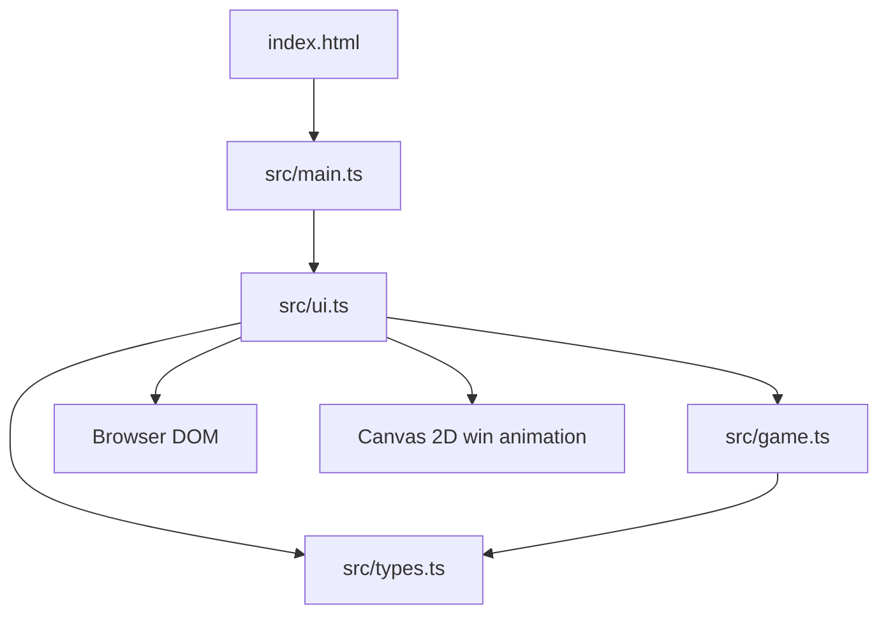

# Minesweeper System Design Summary

## Purpose

This project is a browser-based Minesweeper game implemented in TypeScript. The player selects a mine count, reveals safe cells, flags suspected mines, and starts a new game after a win or loss.

## Architecture



- `index.html` provides the application root and loads the compiled entry point.
- `src/main.ts` starts the application by rendering the start screen.
- `src/ui.ts` owns screen rendering, browser events, board-cell interaction, HUD updates, and the win animation.
- `src/game.ts` owns board creation, mine placement, adjacent-mine counts, revealing, flagging, win detection, and loss handling.
- `src/types.ts` defines shared constants, data structures, coordinate helpers, and bounds checking.
- `style.css` supplies the visual design and responsive board layout.

## Data Model

A `Board` contains:

```text
Board {
  cells: Cell[][]
  rows: number
  cols: number
  mineCount: number
  gameStatus: 'ready' | 'playing' | 'won' | 'lost'
}
```

Each `Cell` contains:

```text
Cell {
  isMine: boolean
  adjacentMines: number
  state: 'covered' | 'flagged' | 'revealed'
}
```

Coordinates are zero-indexed internally. The UI renders a 10-by-10 board, with columns A-J and rows 1-10 for player-facing labels.

## Game Flow

1. `renderStartScreen` displays the mine-count slider from 10 through 20.
2. Starting a game calls `createGame`, which creates an empty 10-by-10 board in `ready` status.
3. The first `revealCell` call places mines randomly while excluding the clicked cell and its surrounding eight-cell safe area.
4. Mine placement increments `adjacentMines` on neighboring cells and changes the board to `playing`.
5. Revealing a safe zero-count cell performs an iterative flood reveal of neighboring safe cells.
6. Revealing a mine reveals every mine and changes the board to `lost`.
7. Revealing every non-mine cell changes the board to `won` and flags remaining mines.
8. Right-clicking a covered cell toggles its flag. The number of flags cannot exceed `mineCount`.
9. After every action, the UI rerenders the board and displays `mineCount - flaggedCount` as the remaining-mine counter.
10. The New Game button returns the player to the configuration screen.

## State Rules

- `ready`: mines have not been generated; the first reveal initializes the board.
- `playing`: the player can reveal and flag cells.
- `won`: all safe cells are revealed; further actions are ignored.
- `lost`: a mine was revealed; further actions are ignored.
- A revealed cell cannot be flagged.
- A flagged cell cannot be revealed.
- Flagging is capped at the selected mine count, but flags may always be removed.

## Extension Points

- Board dimensions and mine limits are centralized in `src/types.ts`.
- Game rules are isolated from the DOM in `src/game.ts`, allowing unit tests or another UI to reuse them.
- Rendering is isolated in `src/ui.ts`, allowing future keyboard controls, touch controls, or alternate layouts.
- The current `Board` model can be extended with timers, player metadata, difficulty names, or persisted game state without changing the cell interaction API.
- `src/game.test.ts` provides a starting point for expanding automated rule coverage.

## Verification

Run the complete build and gameplay tests with:

```bash
npm test
```

The test command compiles TypeScript and runs the Node test suite in `dist/game.test.js`.
